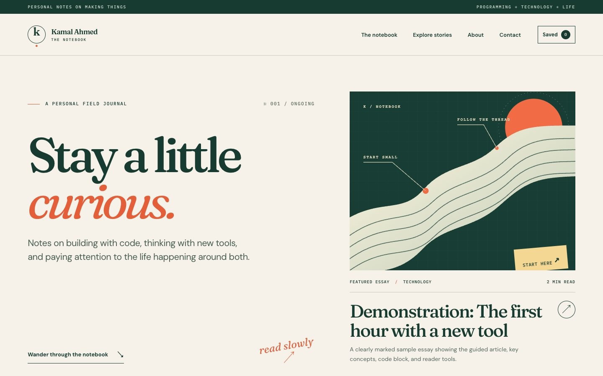
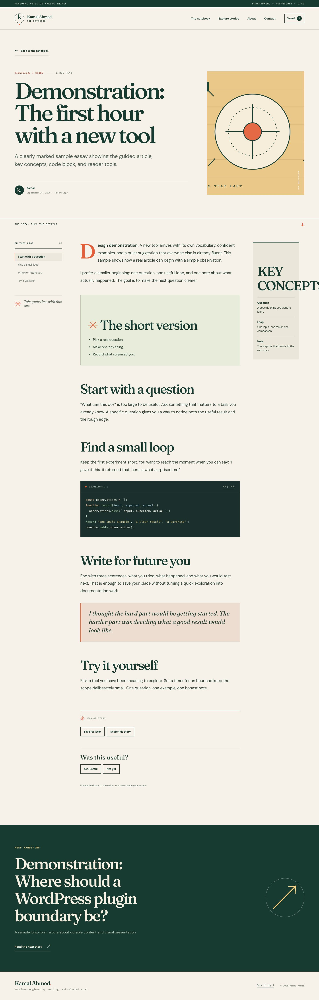
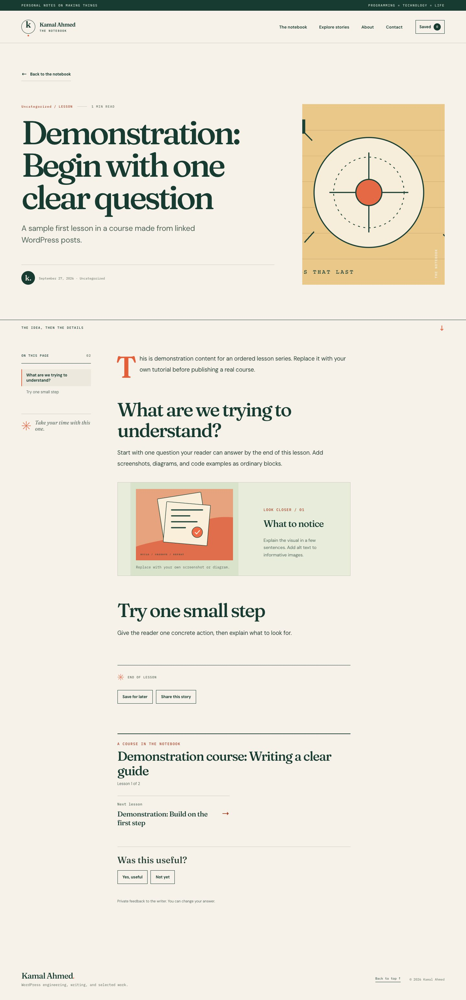
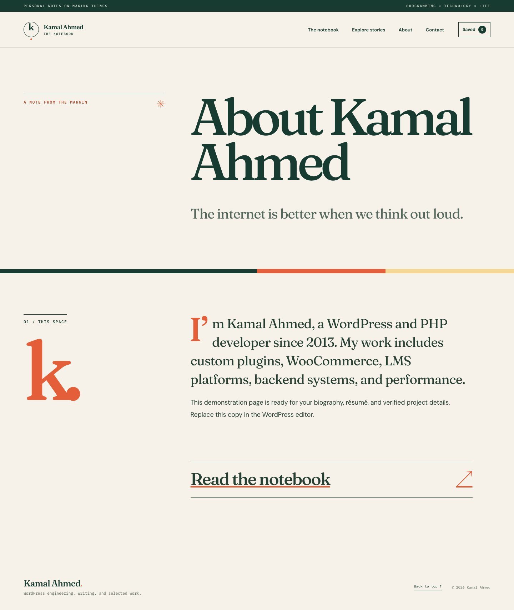
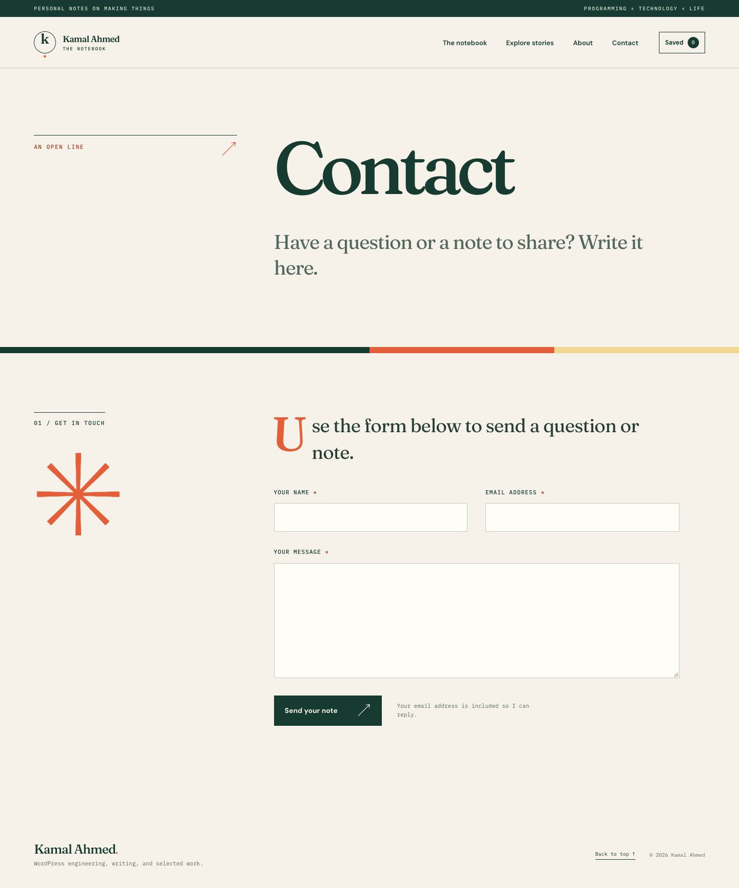
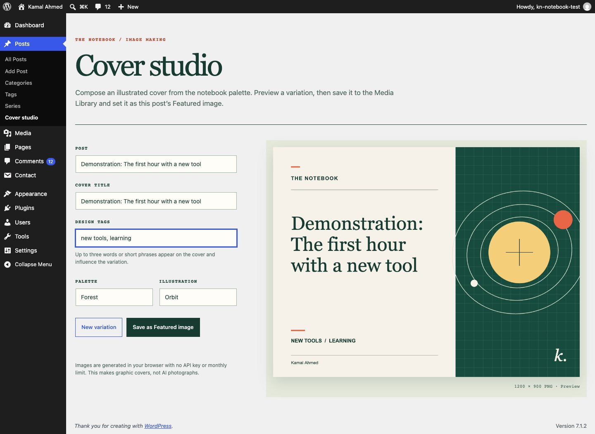

# Kamal Notebook

An editorial WordPress theme for articles, tutorials, and linked lesson series. The repository contains the presentation theme in `theme/` and durable features in the companion plugin `plugin/`.

## Screenshots

These local screenshots use clearly marked demonstration articles. The Contact screenshot shows the form after a receiver address was temporarily configured for preview; no receiver address is included in the package.

| Home | Article |
| --- | --- |
|  |  |

| Linked course lesson | About and Contact |
| --- | --- |
|  |   |

## Why the source is in `Downloads/code`

`~/Downloads/code/kamal-notebook` is only the current development checkout. It is not part of WordPress at runtime. The local WordPress installation links `wp-content/themes/kamal-notebook` to this repository's `theme/` folder and `wp-content/plugins/kamal-notebook-tools` to `plugin/`. The `.git` directory belongs at the repository root so it tracks both parts. You can move the checkout to a permanent folder such as `~/Projects/kamal-notebook`; then update those two local links. The installable ZIPs can be installed on any WordPress site without this folder layout. The retired ProWriter theme is no longer in the local site's themes directory.

## Install and import the demonstration site

Install and activate **Kamal Notebook** and **Kamal Notebook Tools**. Open **Appearance → Import Notebook demo**, then press **Import demo**. This adds five clearly labeled demonstration posts, an About page and a Contact page if those slugs are free, categories, illustrations, and an explicit featured sample post. It also applies the prototype's home introduction and grid layout on the first import. Running the importer again skips existing demo posts and leaves later settings changes alone.

The importer preserves existing posts, pages with the same slugs, site title, logo, and media. A fresh site therefore gives the closest match to the prototype. The first import switches the front page to latest posts; previous front page and theme settings are saved in `knt_demo_previous_options` for recovery. Replace demonstration copy before using the site publicly.

Build installable ZIPs with `python3 local/package.py`. The ZIPs appear in `dist/`.

## Featured story, cover image, and next story

In **Posts → Edit Post → Post sidebar**, check **Featured article on the homepage** and save. Exactly one post can be marked at a time. With no marked published post, the homepage shows a neutral illustration and the article list below. The demonstration importer marks its sample lead deliberately; ordinary publishing never chooses a featured article for you.

Set the actual image in **Post → Featured image**. If a post has no image, the theme uses one of five bundled SVG illustrations for its card and article hero. The original repeated green graphic is `feature.svg`; it now remains only for the empty homepage lead. **Posts → Cover studio** creates a new 1200 × 900 PNG using the theme palette. Enter a cover title and up to three design tags, choose a palette and illustration, preview variations, then save the one you want. Saving puts it in the Media Library and sets it as that post's Featured image. The original recipe is stored with the attachment. This graphic generator runs in the browser with no API cost or monthly limit; it creates designed covers rather than AI photographs.

The **Read the next story** section chooses the newest *older* published post in the same category. If there is none, it chooses the newest older post overall. At the oldest post it disappears, so two posts do not point back and forth. Course lessons use their own ordered navigation instead.

## Write with a live outline and highlighted code

Open **Posts → Add New** and choose **Guided article** or **Quick note**. Use Heading 2 blocks for sections. The theme builds linked headings on the article page. In the editor's **Post** sidebar, choose **Preview table of contents** to open and scroll to the live outline; it updates as you edit. WordPress can remember that panel as collapsed, and a pattern picker or editing-lock dialog can cover the editor until dismissed. The preview uses the article's colors and section styling; the front end adds working anchor links and scroll tracking.

Insert the **Highlighted code example** pattern for an editable **Notebook Code** block. Syntax highlighting is included for JavaScript, CSS, HTML, JSON, PHP, Bash, and Python; plain text is also supported. Choose the language and filename in the block controls. The dark green code surface follows the theme palette, with distinct language colors and a copy button on the site. WordPress's ordinary Code block does not receive Notebook highlighting.

## Courses and lesson series

Create one WordPress post per lesson. Under **Posts → Series**, create a course name. Edit each lesson and choose that series in the **Course / series lesson** editor box, then set its lesson number. Published lessons appear in number order with **Previous lesson** and **Next lesson** links. Each keeps its own direct URL, search visibility, editing history, and shareable bookmark. Clicking between supported lessons swaps the article content without a full page refresh; browser Back works. If a lesson contains a legacy script, iframe, or form, its link uses a normal page load so that interaction stays reliable.

Use **Visual walkthrough**, Image, Gallery, Media & Text, and Notebook Code blocks inside each lesson. The **Tutorial with lessons** pattern still works for a shorter tutorial kept in one post, using Heading 2 sections as its internal outline. For a long course or one that needs independent lesson URLs, use the linked Series controls. The existing drag-and-drop tutorial is legacy HTML and stays isolated in a frame; it can be rewritten as separate block-based lesson posts when you are ready, without altering the original automatically.

## About, Contact, and settings

The `about` and `contact` page slugs use matching editorial page templates. Existing page text stays editable in WordPress. The About page does not invent a biography. The local Contact page's old Contact Form 7 shortcode was replaced with a short introduction so it uses the new form.

Under **Appearance → Notebook settings → Contact page**, add one or more receiver email addresses separated by commas. The form appears after a receiver is configured. It uses WordPress mail, a nonce, a hidden honeypot field, input validation, duplicate suppression, and per-address/IP rate limits; no form plugin or external CAPTCHA service is required. Mail delivery still depends on the hosting site's WordPress mail configuration, and these measures cannot guarantee zero spam. The theme settings page also points to the post editor controls for the featured story, Featured image, outline, code, and series.
